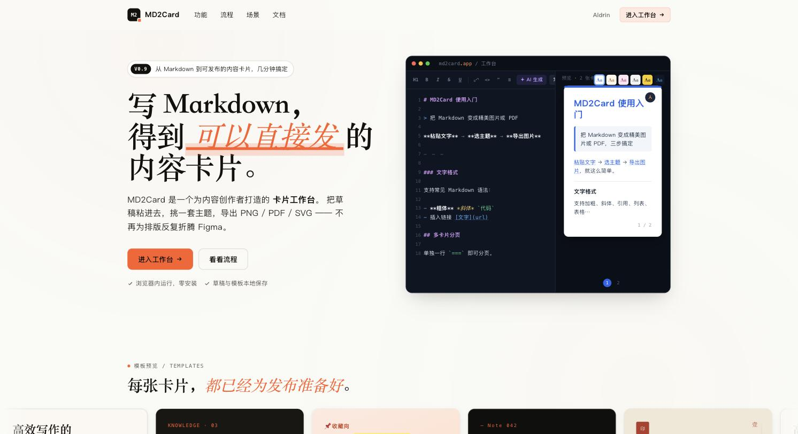
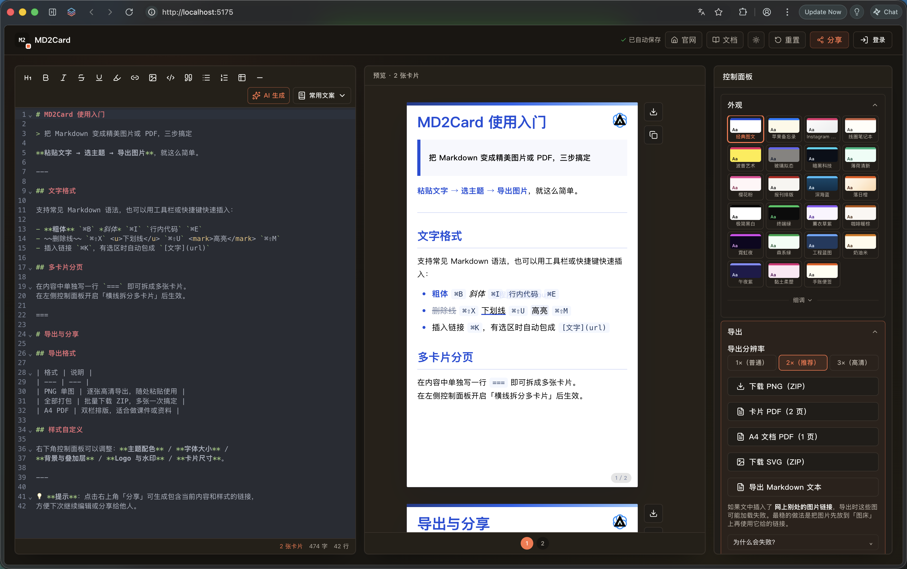
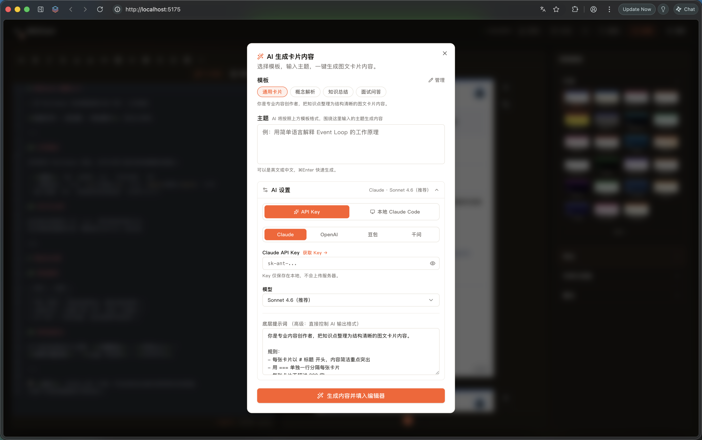

[English](./README.en.md) | 中文



# MD2Card · 墨工坊

**把 Markdown 变成精美内容卡片，三步搞定。**

写 Markdown → 选主题 → 导出 PNG / PDF / SVG

[](./LICENSE)
[](https://github.com/agnostic-ap/md2card/stargazers)
[](https://agnostic-ap.github.io/md2card/)

🌐 **在线体验**：[mdcard.cn](https://mdcard.cn) · [免费试用 →](https://agnostic-ap.github.io/md2card/)



---

## 功能亮点

- **实时预览** — Markdown 编辑器与卡片预览同步渲染，所见即所得
- **多主题** — 十余套精心设计的配色方案，支持字体、颜色、背景、叠加层细调
- **多卡片分页** — 用 `===` 把一篇 Markdown 拆成多张卡片，批量导出为 ZIP
- **多格式导出** — PNG（高清 1×/2×/3×）、SVG、卡片 PDF、A4 文档 PDF、Markdown 原文
- **AI 辅助生成** — 接入 OpenAI / Claude / 豆包 / 通义千问等，一句话生成结构化卡片内容

  
- **水印 & Logo** — 自定义水印文字、位置、透明度；上传个人/品牌 Logo
- **分享链接** — 将当前内容与样式压缩为 URL，一键分享给他人继续编辑
- **用户系统** — 注册登录后自动同步云端草稿，换设备无缝继续

---

## 快速自部署

### Docker（推荐）

> 仅需 Docker

```bash
git clone https://github.com/agnostic-ap/md2card.git
cd md2card
docker compose up -d
```

访问 `http://localhost` 即可使用。数据持久化在 Docker volume 中。

### 手动部署

> 需要 Node.js ≥ 20、Nginx、PM2

```bash
git clone https://github.com/agnostic-ap/md2card.git
cd md2card

# 构建前端
cd front && npm ci && npm run build && cd ..

# 启动后端
cd backend && npm ci --omit=dev && cd ..

# 使用 PM2 管理进程
pm2 start deploy/ecosystem.config.cjs
```

详细部署文档（Nginx 配置、HTTPS、备份等）见 [deploy/README.md](./deploy/README.md)。

---

## 项目结构

```
md2card/
├── front/          # 前端 — Vite + React + TypeScript + Tailwind CSS
├── backend/        # 后端 — Node.js + Fastify（JSON 文件存储）
└── deploy/         # 部署脚本与配置（Nginx、PM2、自动化脚本）
```

## 技术栈

| 层 | 技术 |
|---|---|
| 前端框架 | React 19 + TypeScript + Vite |
| 样式 | Tailwind CSS v4 + shadcn/ui |
| 编辑器 | CodeMirror 6 |
| 后端 | Fastify 5 + Node.js |
| 认证 | Token（PBKDF2 密码哈希，30 天 Session） |

---

## 本地开发

```bash
# 后端（新建终端）
cd backend
cp ../deploy/env.backend.example .env   # 填写 FRONTEND_ORIGIN
npm run dev

# 前端
cd front
cp .env.example .env.local
npm run dev
```

前端默认在 `http://localhost:5173`，API 请求通过 Vite proxy 转发到后端。

---

## License

[AGPL-3.0](./LICENSE)
